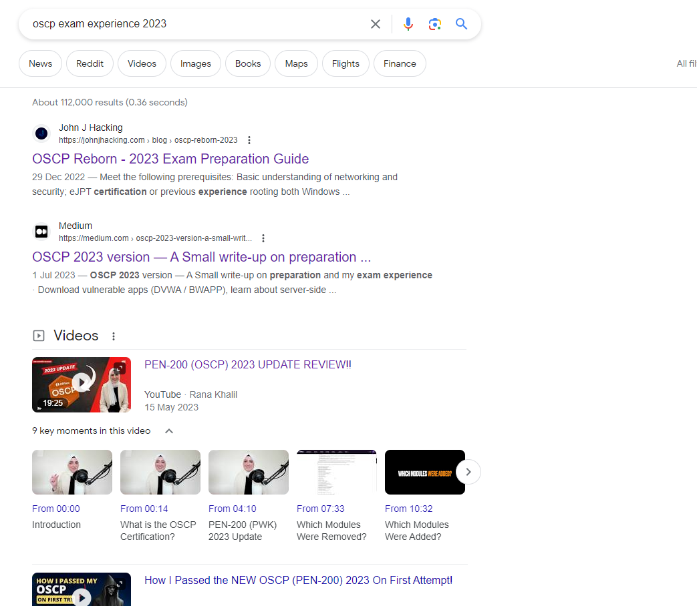

### Introduction

Monday morning. Lets see what the day of work brings. Spreadsheets most likely.

However I decided to dig into the first page of Google with "oscp exam experience 2023"

Grabbed all of the following - and before I go into them - thanks to everyone who did a write up or made video. Two things, well done for making it good enough that it's on the first page of Google. Second thanks for the information

- [John J Hacking] - OSCP Reborn - 2023 Exam Preparation Guide
- [Neelamegha Kannan S] - OSCP 2023 version — A Small write-up on preparation and my exam experience
- [Rana Khalil] - PEN-200 (OSCP) 2023 UPDATE REVIEW!!
- [Daniel Kula] - Beginner's Guide To OSCP 2023
- [Cyber-Security-Certifications] - OSCP-Study-Guide-2023 (GitHub)
- [John Stawinski IV] - 2023 OSCP Study Guide (NEW EXAM FORMAT) & Scoring 100 Points On The New OSCP Exam: MY Exam Experience
- [xannsecurity] - How I Passed the NEW OSCP (PEN-200) 2023 On First Attempt!

### Sub1

### Sub2

### Sub3

### Conclusion

[OSCP]: https://www.offsec.com/courses/pen-200/
[John J Hacking]: https://johnjhacking.com/blog/oscp-reborn-2023/
[Neelamegha Kannan S]: https://medium.com/@kannnannmk/oscp-2023-version-a-small-write-up-on-preparation-and-my-exam-experience-55c31d543d17
[Rana Khalil]: https://www.youtube.com/watch?v=bEzDfY9bSsU
[Daniel Kula]: https://infosecwriteups.com/guide-to-oscp-2023-37c0aea0dec0
[Cyber-Security-Certifications]: https://github.com/Cyber-Security-Certifications/OSCP-Study-Guide-2023
[John Stawinski IV]: https://johnstawinski.com/2022/10/09/oscp-2023-study-guide-new-exam-format/
[John Stawinski IV - Article 2]: https://johnstawinski.com/2022/10/09/scoring-100-points-on-the-new-oscp-exam-my-exam-experience/
[xannsecurity]: https://www.youtube.com/watch?v=CmTddSiUGJs